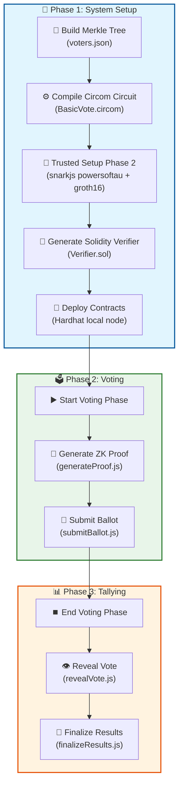
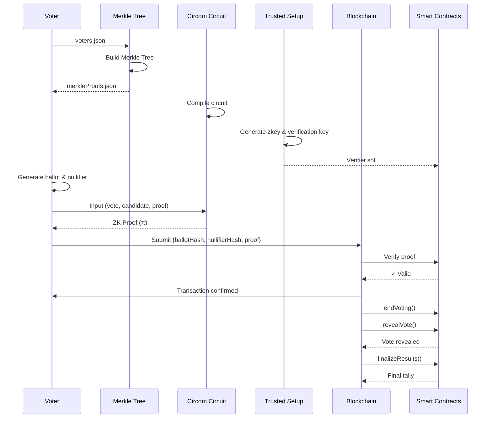

# Zero-Knowledge Voting System - Workflow Chart

## Detailed Flow Description

### Phase 1: System Setup
| Step | Command/Script | Description |
|------|----------------|-------------|
| 1 | `scripts/buildMerkleTree.js` | Build Merkle tree from `voters.json` |
| 2 | `circom BasicVote.circom` | Compile Circom circuit to R1CS & WASM |
| 3 | `snarkjs groth16 setup` | Trusted setup (Powers of Tau + zkey) |
| 4 | `snarkjs zkey export solidityverifier` | Generate Solidity verifier contract |
| 5 | `hardhat run scripts/deploy.js` | Deploy Verifier & Voting contracts |

### Phase 2: Voting
| Step | Command/Script | Description |
|------|----------------|-------------|
| 6 | `hardhat run scripts/startVoting.js` | Open voting period |
| 7 | `scripts/generateProof.js` | Generate ZK proof for voter's ballot |
| 8 | `hardhat run scripts/submitBallot.js` | Submit encrypted ballot to blockchain |

### Phase 3: Tallying
| Step | Command/Script | Description |
|------|----------------|-------------|
| 9 | `hardhat run scripts/endVoting.js` | Close voting period |
| 10 | `hardhat run scripts/revealVote.js` | Decrypt and reveal vote |
| 11 | `hardhat run scripts/finalizeResults.js` | Calculate final vote tally |

## Data Flow

