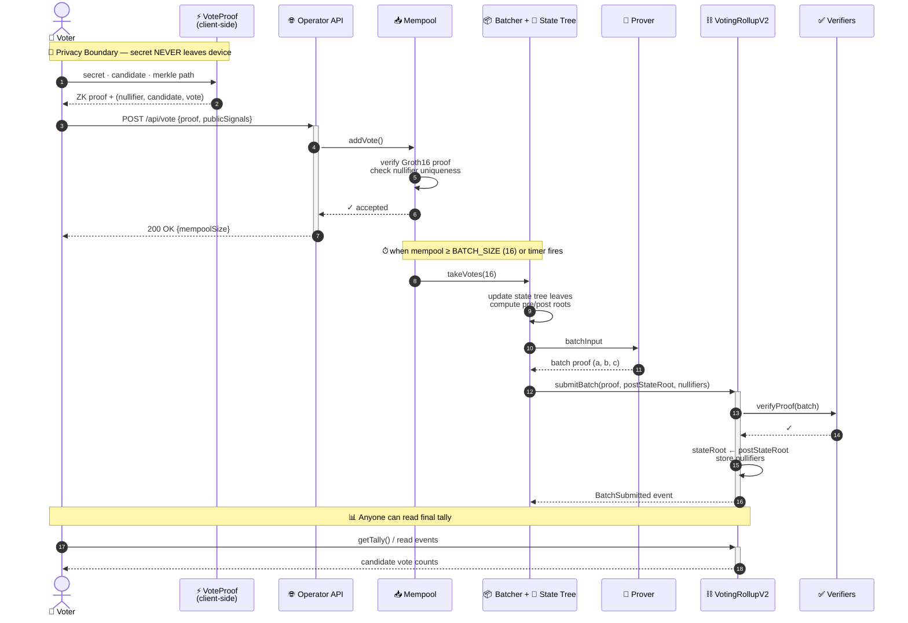

# End-to-End Architecture — ZK Rollup Voting System

> A privacy-preserving on-chain voting system using a two-layer zero-knowledge rollup architecture.
> Voters prove eligibility client-side without revealing secrets; the operator batches verified votes
> into a single state-transition proof submitted to Ethereum.

---

## 1. High-Level System Architecture

```mermaid
flowchart LR
    %% ============ CLIENT TIER ============
    subgraph CLIENT["👤 &nbsp; CLIENT TIER &nbsp; — &nbsp; Voter Devices"]
        direction TB
        U["🗳️ &nbsp; Voter<br/><i>browser / CLI</i>"]
        SK["🔐 &nbsp; Voter Secret<br/><i>voter-secrets.json</i>"]
        MP["🌳 &nbsp; Merkle Proof<br/><i>merkleProofs.json</i>"]
        VPC["⚡ &nbsp; VoteProof Circuit<br/><i>BasicVote.circom · snarkjs</i>"]

        U --> SK
        U --> MP
        SK --> VPC
        MP --> VPC
    end

    %% ============ APPLICATION TIER ============
    subgraph BACKEND["⚙️ &nbsp; APPLICATION TIER &nbsp; — &nbsp; Rollup Operator (Node.js)"]
        direction TB
        API["🌐 &nbsp; REST API<br/><i>Express · :3000</i><br/>POST /api/vote · /force-batch<br/>GET /api/tally · /status"]
        MEM["📥 &nbsp; Mempool<br/><i>per-vote ZK verify<br/>nullifier dedup</i>"]
        BAT["📦 &nbsp; Batcher<br/><i>assembles 16-vote batches<br/>builds Merkle paths</i>"]
        PRV["🧮 &nbsp; Prover<br/><i>BatchStateUpdate proof<br/>snarkjs · groth16</i>"]
        SUB["📤 &nbsp; Submitter<br/><i>ethers.js · tx signing</i>"]

        API --> MEM --> BAT --> PRV --> SUB
    end

    %% ============ DATA TIER ============
    subgraph DATA["💾 &nbsp; DATA TIER &nbsp; — &nbsp; Off-Chain State"]
        direction TB
        ST["🌲 &nbsp; State Tree<br/><i>tally Merkle tree<br/>5 levels · Poseidon hash</i>"]
        VT["🌳 &nbsp; Voter Tree<br/><i>eligibility Merkle root</i>"]
        NS["🚫 &nbsp; Nullifier Set<br/><i>in-memory dedup</i>"]
    end

    %% ============ BLOCKCHAIN TIER ============
    subgraph CHAIN["⛓️ &nbsp; BLOCKCHAIN TIER &nbsp; — &nbsp; Ethereum L1"]
        direction TB
        VR["📜 &nbsp; VotingRollupV2<br/><i>main contract</i>"]
        VV["✅ &nbsp; VoteVerifier<br/><i>Groth16 — Layer 1</i>"]
        BV["✅ &nbsp; BatchVerifier<br/><i>Groth16 — Layer 2</i>"]
        EVT["📰 &nbsp; Events / Logs<br/><i>BatchSubmitted</i>"]

        VR --> VV
        VR --> BV
        VR --> EVT
    end

    %% ============ EXTERNAL ============
    subgraph EXT["🔧 &nbsp; INFRASTRUCTURE"]
        direction TB
        RPC["🔌 &nbsp; JSON-RPC<br/><i>Hardhat / Sepolia / Infura</i>"]
        ETH["🦊 &nbsp; Ethereum Network"]
        EXP["🔍 &nbsp; Etherscan<br/><i>verification</i>"]
    end

    %% ============ FLOWS ============
    VPC -- "1. proof + (candidate, vote)<br/>(secret stays local)" --> API
    BAT <-->|"reads/updates"| ST
    BAT <-->|"reads root"| VT
    MEM <-->|"checks/inserts"| NS
    SUB -- "2. submitBatch(proof, postRoot, nullifiers)" --> RPC
    RPC --> ETH --> VR
    VR -- "3. verify ✓ → update stateRoot" --> EVT
    EVT -. "4. tally / receipt" .-> U
    VR -. "view: stateRoot, tallies" .-> EXP

    %% ============ STYLING ============
    classDef clientStyle fill:#0f3a2e,stroke:#34d399,stroke-width:2px,color:#d1fae5
    classDef backendStyle fill:#1e2a4a,stroke:#60a5fa,stroke-width:2px,color:#dbeafe
    classDef dataStyle fill:#3a2a1a,stroke:#fbbf24,stroke-width:2px,color:#fef3c7
    classDef chainStyle fill:#3a1a1a,stroke:#f87171,stroke-width:2px,color:#fee2e2
    classDef extStyle fill:#2a1a3a,stroke:#a78bfa,stroke-width:2px,color:#ede9fe

    class U,SK,MP,VPC clientStyle
    class API,MEM,BAT,PRV,SUB backendStyle
    class ST,VT,NS dataStyle
    class VR,VV,BV,EVT chainStyle
    class RPC,ETH,EXP extStyle
```

---

## 2. End-to-End Request / Response Flow

---

## 3. Component Responsibilities

| Tier | Component | Responsibility | Key Tech |
|------|-----------|----------------|----------|
| 👤 **Client** | VoteProof Circuit | Prove eligibility & encode vote without revealing secret | `circom`, `snarkjs`, Groth16 |
| ⚙️ **Backend** | REST API | Accept vote submissions, expose status & tally | `express` |
| ⚙️ **Backend** | Mempool | Per-vote ZK verification + nullifier dedup | `snarkjs.groth16.verify` |
| ⚙️ **Backend** | Batcher | Assemble 16 votes, update state tree, build batch input | Poseidon Merkle tree |
| ⚙️ **Backend** | Prover | Generate succinct batch state-transition proof | `BatchStateUpdate.circom` |
| ⚙️ **Backend** | Submitter | Sign & broadcast L1 transaction | `ethers.js` |
| 💾 **Data** | State Tree | Off-chain tally accumulator (root anchored on-chain) | Poseidon hash, 5 levels |
| 💾 **Data** | Voter Tree | Eligibility Merkle root | Poseidon hash |
| ⛓️ **Chain** | VotingRollupV2 | Verify proofs, advance state root, store nullifiers | Solidity 0.8 |
| ⛓️ **Chain** | Vote / Batch Verifier | Pure on-chain Groth16 verification | Auto-generated Solidity |
| 🔧 **Infra** | RPC + Etherscan | Network access & transparency | Hardhat / Sepolia |

---

## 4. Why This Architecture

| Property | How It's Achieved |
|----------|-------------------|
| 🔒 **Privacy** | Voter secret stays on device; operator only sees `(nullifier, candidate)` |
| ⚡ **Scalability** | 16 votes → 1 on-chain proof verification (~constant gas) |
| ✅ **Integrity** | Two-layer ZK: per-vote eligibility + batched state transition |
| 🛡️ **Anti–double-vote** | On-chain nullifier registry; rejected client-side AND on-chain |
| 🔍 **Auditability** | All state roots & batches emitted as events; tally reproducible from chain |
| 💸 **Cost** | Off-chain proving cost amortized across batch; on-chain verify is O(1) |

---

*Generated from source: [`operator/index.js`](../operator/index.js), [`contracts/VotingRollupV2.sol`](../contracts/VotingRollupV2.sol), [`circuits/`](../circuits/)*
