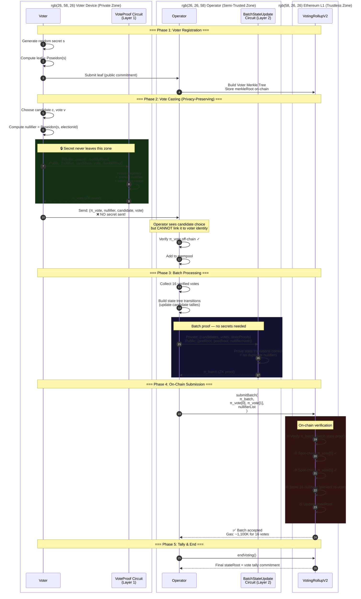

# Privacy-Preserving zk-Rollup Voting Protocol (V2 Two-Layer)

This diagram shows the step-by-step protocol flow with privacy boundaries.

```mermaid
sequenceDiagram
    autonumber

    box rgb(26, 58, 26) Voter Device (Private Zone)
        participant V as Voter
        participant L1 as VoteProof Circuit<br/>(Layer 1)
    end

    box rgb(26, 26, 58) Operator (Semi-Trusted Zone)
        participant OP as Operator
        participant L2 as BatchStateUpdate<br/>Circuit (Layer 2)
    end

    box rgb(58, 26, 26) Ethereum L1 (Trustless Zone)
        participant SC as VotingRollupV2
    end

    Note over V,SC: === Phase 1: Voter Registration ===

    V->>V: Generate random secret s
    V->>V: Compute leaf = Poseidon(s)
    V->>OP: Submit leaf (public commitment)
    OP->>SC: Build Voter Merkle Tree<br/>Store merkleRoot on-chain

    Note over V,SC: === Phase 2: Vote Casting (Privacy-Preserving) ===

    V->>V: Choose candidate c, vote v
    V->>V: Compute nullifier = Poseidon(s, electionId)

    rect rgb(20, 50, 20)
        Note over V,L1: 🔒 Secret never leaves this zone
        V->>L1: Private: {secret, merkleProof}<br/>Public: {nullifier, candidate, vote, merkleRoot}
        L1->>L1: Prove eligibility<br/>+ correct nullifier<br/>+ valid vote range
        L1-->>V: π_vote (ZK proof)
    end

    V->>OP: Send: {π_vote, nullifier, candidate, vote}<br/>❌ NO secret sent!

    Note over OP: Operator sees candidate choice<br/>but CANNOT link it to voter identity

    OP->>OP: Verify π_vote off-chain ✓
    OP->>OP: Add to mempool

    Note over V,SC: === Phase 3: Batch Processing ===

    OP->>OP: Collect 16 verified votes
    OP->>OP: Build state tree transitions<br/>(update candidate tallies)

    rect rgb(20, 20, 50)
        Note over OP,L2: Batch proof — no secrets needed
        OP->>L2: Private: {candidates, votes, stateProofs}<br/>Public: {preRoot, postRoot, nullifierHash}
        L2->>L2: Prove state transitions correct<br/>+ no duplicate nullifiers
        L2-->>OP: π_batch (ZK proof)
    end

    Note over V,SC: === Phase 4: On-Chain Submission ===

    OP->>SC: submitBatch(<br/>  π_batch,<br/>  π_vote[0], π_vote[1],<br/>  nullifierList<br/>)

    rect rgb(50, 20, 20)
        Note over SC: On-chain verification
        SC->>SC: ① Verify π_batch (batch state proof)
        SC->>SC: ② Spot-check π_vote[0] ✓
        SC->>SC: ③ Spot-check π_vote[1] ✓
        SC->>SC: ④ Store 16 nullifiers (prevent re-vote)
        SC->>SC: ⑤ Update stateRoot
    end

    SC-->>OP: ✅ Batch accepted<br/>Gas: ~1,100K for 16 votes

    Note over V,SC: === Phase 5: Tally & End ===

    OP->>SC: endVoting()
    SC-->>OP: Final stateRoot = vote tally commitment
```

## Privacy Guarantees

```mermaid
graph LR
    subgraph knows["What Each Party Knows"]
        direction TB
        subgraph voter["👤 Voter Knows"]
            A1["✅ Their own secret"]
            A2["✅ Their own vote"]
            A3["✅ Their nullifier"]
        end
        subgraph operator["⚙️ Operator Knows"]
            B1["✅ Anonymous vote choices"]
            B2["✅ Nullifier hashes"]
            B3["❌ Which voter = which vote"]
            B4["❌ Voter secrets"]
        end
        subgraph chain["⛓️ On-Chain Verifiable"]
            C1["✅ State root transitions"]
            C2["✅ No double voting"]
            C3["✅ Spot-checked vote proofs"]
            C4["❌ Individual votes"]
        end
    end

    style voter fill:#1a3a1a,stroke:#4ade80
    style operator fill:#1a1a3a,stroke:#60a5fa
    style chain fill:#3a1a1a,stroke:#f87171
```
