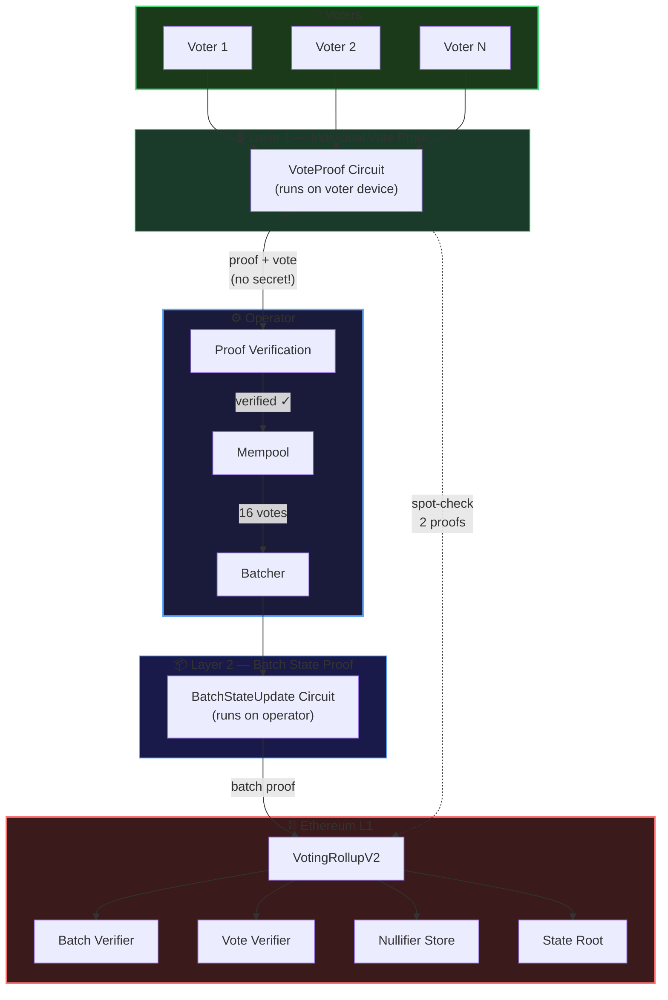

# zk-Rollup Blockchain Voting Architecture (V2 Two-Layer)

```mermaid
graph TB
    subgraph Voters["👤 Voters"]
        V1["Voter 1"]
        V2["Voter 2"]
        VN["Voter N"]
    end

    subgraph Layer1["🔒 Layer 1 — Individual Vote Proof"]
        VP["VoteProof Circuit<br/>(runs on voter device)"]
    end

    subgraph Operator["⚙️ Operator"]
        VER["Proof Verification"]
        MEM["Mempool"]
        BATCH["Batcher"]
    end

    subgraph Layer2["📦 Layer 2 — Batch State Proof"]
        BSC["BatchStateUpdate Circuit<br/>(runs on operator)"]
    end

    subgraph Blockchain["⛓️ Ethereum L1"]
        SC["VotingRollupV2"]
        BV["Batch Verifier"]
        VV["Vote Verifier"]
        NS["Nullifier Store"]
        ST["State Root"]
    end

    V1 & V2 & VN --> VP
    VP -->|"proof + vote<br/>(no secret!)"| VER
    VER -->|"verified ✓"| MEM
    MEM -->|"16 votes"| BATCH
    BATCH --> BSC
    BSC -->|"batch proof"| SC
    VP -.->|"spot-check<br/>2 proofs"| SC
    SC --> BV & VV
    SC --> NS & ST

    style Voters fill:#1a3a1a,stroke:#4ade80,stroke-width:2px
    style Layer1 fill:#1a3a2a,stroke:#4ade80,stroke-width:1px
    style Operator fill:#1a1a3a,stroke:#60a5fa,stroke-width:2px
    style Layer2 fill:#1a1a4a,stroke:#60a5fa,stroke-width:1px
    style Blockchain fill:#3a1a1a,stroke:#f87171,stroke-width:2px
```
